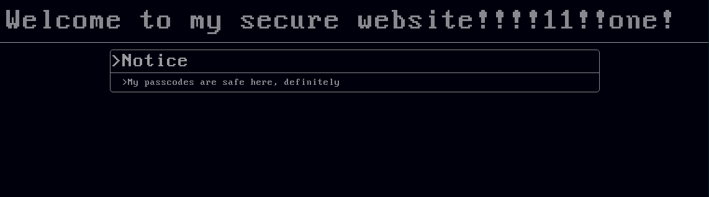
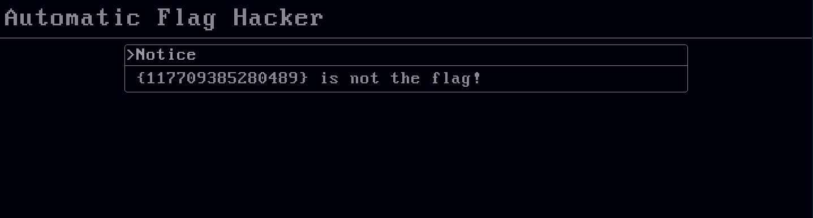
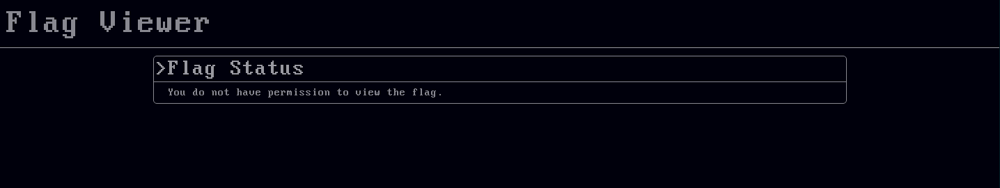
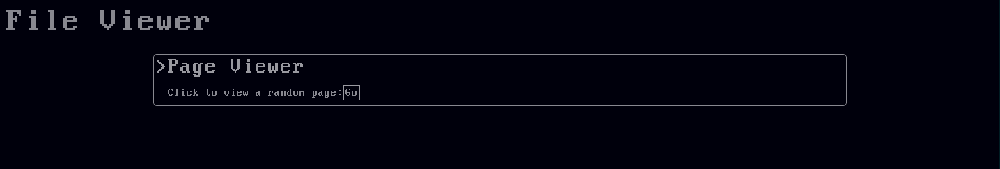
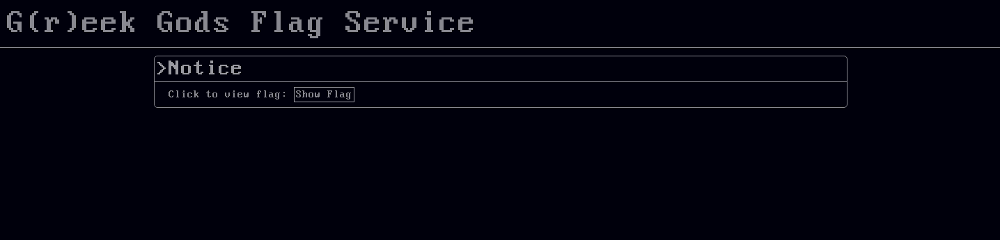
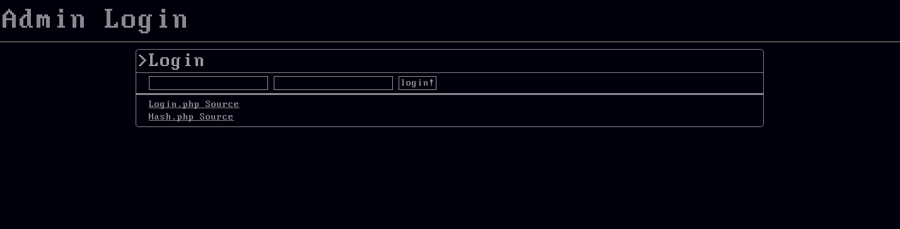

# BearCTF Writeups #

The following is a set of solutions, flags, and explanations of the problems in BearCTF.

***

## 1\. Julius! ##

###### Focus: General Cryptography ######

>Problem: **julius.txt**
>
>Hint: Try looking up some basic ciphers.

When opened, _julius.txt_ contains `{wkh_idxow_ghdu_euxwxv_lv_lq_rxu_flskhu}`. Decrypting it as a [Caesar Cipher](http://https://en.wikipedia.org/wiki/Caesar_cipher) reveals the flag: `{the_fault_dear_brutus_is_in_our_cipher}`

***

## 2\. True Hacking ##

###### Focus: Inspection/Investigation ######

>Problem: I bet you can't hack into my **super secure site**.
>
>Hint: Try some more "inspection"

The link in the problem takes you to a website that looks like the following:

Opening the page inspector _or_ viewing the source code reveals the following snippet: `<!-- the flag is : {no_comment} -->`.

***

## 3\. The Client Is Always Right ##

###### Focus: Reverse Engineering ######

>Problem: **Here.**
>
>Hint: How does it determine if a password is correct?

Following the link in the problem takes you to this page:

While on the page, the number in braces will change every .2 seconds. Due to the size of the number, and the speed it cycles at, it is pretty much impossible to see the actual flag show up on screen. In order to solve the problem, you have to look at and understand the source code. Particularly, this snippet:
`"{" + guess + "} is " + (guess !== 132458100982469 ? " not " : "") + "the flag!"`
With a little understanding of javascript, the language the code is written in, one can see that the site says that `{132458100982469}` is the flag.

***

## 4\. Stegosaurus ##

###### Focus: Steganography/Information Hiding ######

>Problem: What happened to my **stegosaurus**?
>
>Hint: Who says you have to open it like a picture?

The picture in question is:

Opening it as a picture reveals little, besides the fact that it is slightly corrupted. However, opening it in a texteditor, like _NotePad_ or _TextEdit_ and searching (using cmd + f) for the phrase "flag" finds: `flag is{dinosaur}`. This extra phrase is the cause of the corruption, and the flag.

***

## 5\. Magic ##

###### Focus: Information Recovery ######
>Problem: Something is wrong with **this image**.
>
>Hint: What makes a png file a png file?

The image in the question is damaged and cannot be viewed in its current state. The task is to fix it, and view what it hides.

Some research into png files and how they work reveals that they all begin with a certain header: `89 50 4E 47 0D 0A 1A 0A`. Opening the image in an editor (an editor that supports hex encoding works best) reveals that the first four bytes, `89 50 4E 47`, are missing. Adding them back in fixes the image, showing:


***

## 6\. Dessert ##

###### Focus: Web Hacking ######

>Problem: The flag can be viewed **here** if you have permission.
>
>Hint: What determines if you have permission on this site? How can it be modified?

Opening the link shows this website:

Clearly, we don't have permission to view the flag. However, careful investigating will find a _cookie_ on the page labeled "canViewFlag", which is set to "0". Using a browser tool, or code such as javascript, we can set the value of this cookie to "1" (which generally stands for true). Reloading the site with the new cookie reveals the flag, `{cookie_monster_would_be_proud}`.

***

## 7\. Be Inclusive ##

###### Focus: Web Hacking/Reverse Engineering ######

>Problem: **This site** reads files. Can it read the flag?
>
>Hint: The flag file is probably named "flag"

Opening the link shows this website:

Clicking the _Go_ button reads a random file (out of the 4 available) onto the page. The text of the files isn't important. What is important, is the structure of the url for each of these pages.

When reading _4.txt_, the url ends in `viewer.php?file=4.txt`. Similarly, _1.txt_ ends with `viewer.php?file=1.txt`. It would appear that having `?file=fileName` opens the file named `fileName`. Following the hint, accessing the url `viewer.php?file=flag` reveals the flag, `{an_equal_opportunity_security_vulnerability}`.

***

## 8\. PHP ##

###### Focus: Web Hacking/Vulnerabilities ######

>Problem: Log in **here** to access the flag.
>
>Hint: What are some php vulnerabilities?

Opening the link shows a simple login page, with a PHP source link, showing the following source:

```
<?php
  include "accounts.php"; #gets the $realUsername, $realPassword, and $flag variables
  $givenUsername = $_GET['u'];
  $givenPassword = $_GET['p'];
  if(strcmp($givenUsername, $realUsername) == 0 && strcmp($givenPassword, $realPassword) == 0){
  echo "<h1>The flag is " . $flag . ".</h1>";
  }else{
    echo "<h1>Invalid credentials</h1><br><a href=\"index.html\">Back</a>";
  }
?>
```

It takes a little knowledge of php, but the crucial part of the program is `if(strcmp($givenUsername, $realUsername) == 0 && strcmp($givenPassword, $realPassword) == 0)`. Looking up some php vulnerabilities reveals two things: the use of `==` is an opening for an attack, as things do not have to be **strictly** equal, and `strcmp` has a vulnerability where passing a non-string as an argument returns an error. In PHP, `error == 0`. Using the fact, we can navigate to the login page with the url `login.php?u[]=a&p[]=a`, passing arrays instead of strings as parameters, thus causing an error and logging in, revealing the flag, `{php_is_the_actual_worst}`.

***

## 9\. XOR ##

###### Focus: Cryptography ######

>Problem: **This file** has the flag in it, but it's been encrypted.
>
>Hint: What is [XOR](https://en.wikipedia.org/wiki/XOR_cipher)?

The linked file contains: `0*9.*8$%*)'2'$%,*%/:>"9 2-'*,6`.

Some research shows that this probably is an XOR ciphers.

XOR ciphers encode letters using the XOR operation. XOR is defined on the bit level, where `0^0=0`,`0^1=1`, and `1^1=0`.

To encode longer strings, bits that line up with each other are XOR'd. We have no key, however. Trying a bunch of keys reveals the key to be, in binary, `1001011`, which decodes the message to be `{areasonablylongandquirkyflag}`.

***

## 10\. Greek Gods ##

###### Focus: Web Hacking ######

>Problem: **This page** uses some fancy loading to get the flag. Something doesn't work quite right, though.
>
>Hint: You might want to read up on a certain AJAX.

Opening the link shows this page:

Clicking on the `Show Flag` button shows a pop-up window saying, "There was an error, I think".

This is clearly a problem.

Inspecting the source code finds an <a href="https://en.wikipedia.org/wiki/Ajax_(programming)">AJAX</a> snippet:

```
var showFlag = function(){
	var xhr = new XMLHttpRequest();
	var fd = new FormData();
	fd.append('auth','true');
	xhr.onreadystatechange = function(){
		if(xhr.readyState === 4 && xhr.status === 200){
			var flag = JSON.parse(xhr.responseText).flag;
			alert('There was an error, I think.');
		}
	}
	xhr.open('POST','flag.php');
	xhr.send(fd);
}
```

There are two ways to solve this problem. One involves changing the AJAX function to display the retrieved flag, by removing the `alert` call and instead using a different `alert` or `console.log` to display the variable `flag`.

The other approach is to view all incoming data and find the flag there.

The flag is found to be:`{homer_was_a_fan_of_javascript}`.

***

## 11\. Hide and Seek ##

###### Focus: Inspection ######

>Problem: Why were you snooping around the source of the problems page? Flag is {out_of_sight_out_of_mind}
>
>Hint: Why are you reading this? You have the flag.

The problem also contains the following HTML code:

	<style>#hideandseek_container{display:none}</style>

Rendering it invisible on the problems page. It is only visible by inspecting the page. Since the challenge is in finding the problem, the flag is readily available.

***

## 12\. Road Safety Authority ##

###### Focus: Cryptography ######

>Problem:We found **this document** with some numbers on it. Can you make sense of it?
>
>Hint: We might have messed up our acronym...

The linked file contains:

```
n:34455880.....
e:5
c:29716197.....
```

Where n and c are much larger numbers omitted for the sake of formatting.

Some research in conjunction with the hint and acronym will find the RSA encryption system, which uses the properties of modular arithmatic to encrypt information. Looking up the decryption algorithm reveals it to be `(c^e) mod n`, where mod is the remainder funciton. Writing a program to do this operation yields a decoded number, which when converted to ASCII characters gives the flag: `{RSA_Encryption_is_not_that_hard}`.

***

## 13\. Hashed Browns ##

###### Focus: Cryptography, Reverse Engineering ######

>Problem: **This site** has GOT to be secure. I wrote an encryption function, and everything.
>
>Hint: That custom_hash function might not be all that hard to figure out

The link in the problem leads to the following page:


There is also source for two files.

Login.php:
```
<?php
  include "accounts.php"; #gets $flag
  include "hash.php"; #gets hash function
  $username = "admin";
  $hashedPassword = "5004555";
  if($_GET['u'] === $username && custom_hash($_GET['p']) === $hashedPassword){
    echo "The flag is:" . $flag . ".";
  }else{
    echo "<h1>Invalid Credentials</h1>";
  }
?>
```
Hash.php
```
<?php
  function custom_hash($inputString){
    $arr = array();
    array_pad($arr,iconv_strlen($inputString),array());
    for($i = 0; $i < iconv_strlen($inputString); $i++){
      $char = ord($inputString{$i}) & 255;
      for($j = 0; $j < 7; $j++){
        $arr[$i][$j] = ($char & (1 << $j)) / (1 << $j);
      }
    }
    $ret = "";
    for($i = 0; $i < 7; $i++){
      $place = 0;
      for($j = 0; $j < count($arr); $j++){
        $place = $place | ($arr[$j][$i] << ($j % 12));
      }
      $place_reduced = 0b101;
      while($place > 0){
        $place_reduced = $place_reduced ^ ($place & 7);
        $place = $place >> 3;
      }
      $ret .= $place_reduced;
    }
    return $ret;
  }
?>
```
With some understanding of PHP, one can see that instead of checking the given password against the literal password, its hash is checked against a stored hash. Now, the task is reversing the `custom_hash` function.

To do this, we need to understand some bitwise operators. `<<` and `>>` are the bitwise shift operators, which shift all bits a certain number left or right. `^` is the XOR operator, `|` is the OR operator, and `&` is the AND operator.

Basically, the function compiles each of the binary digits in the password into a set of 7 octal characters. Using this information, and the hash of the password `5004555`, one can find a password that hashes to the same value, called a collision. One such collision is the original password, `impossibletoguesspassword3`.

***

## 14\. Stegosaurus 2 ##

###### Focus: Steganography ######

>Problem: What's up with **this** stegosaurus?
>
>Hint: I bet there's a pattern to the blue pixels.

The image in question is:

The image is clearly more blue than it should be; in fact, there seems to be a pattern of blue and not-blue pixels throughout the whole picture.

By extracting the most significant bit (that is, the highest binary digit) of the blue value of each pixel of the picture, we can create a file. This is best done using a program. This file contains the flag, repeated over and over. The flag is `{this_is_probably_a_good_enough_flag}`.

***

## 15\. Stegosaurus 3 ##

###### Focus: Steganography ######

>Problem: **This dinosaur** doesn't look too bad...
>
>Hint: No hint this time. You're on your own.

This is probably the hardest problem in the competition.

The picture is:

The first step of this problem is similar to that of Stegosaurus 2, but is less obvious -- rather than the most significant bit, which has a large effect on the image, it is the _least_ significant bit which is important. By extracting the LSB out of each blue color in each pixel, we create a file containing the following image:

However, the problem does not stop there. In order to find the flag, one must then examine the EXIF data of the extracted image, which contains the flag `{this_was_honestly_a_ploy_to_use_a_bunch_of_stegosaurus_pictures}`.

***

# Thanks to all of the people who competed in and supported this project #
